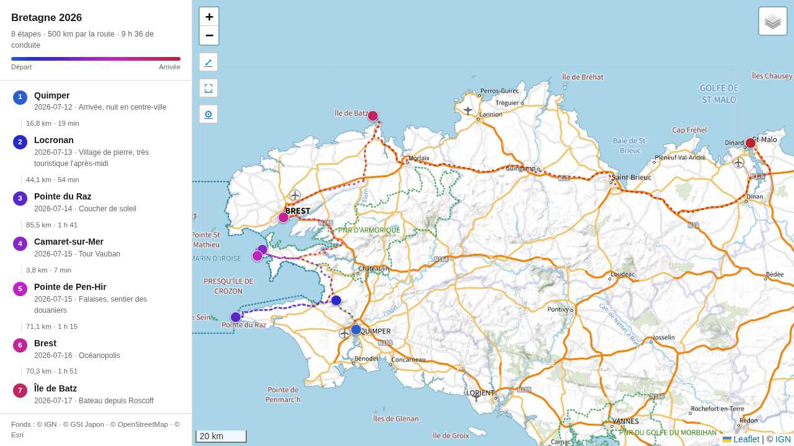

# mapspoints

Transforme une liste de villes ou de sites en **carte web autonome** : chaque
lieu est géocodé et vérifié un par un, relié aux suivants par la route réelle,
et affiché sur le fond de carte de ton choix — IGN, satellite, GSI japonais,
OpenStreetMap.




Gratuit, sans clé d'API, **sans aucune dépendance** : Python 3 et sa
bibliothèque standard suffisent. Le fichier HTML produit s'ouvre dans n'importe
quel navigateur et se partage tel quel.

## Sommaire

- [Installation](#installation)
- [Démarrage rapide](#démarrage-rapide)
- [Écrire sa liste de lieux](#écrire-sa-liste-de-lieux)
- [Vérifier et corriger les lieux](#vérifier-et-corriger-les-lieux)
- [Fonds de carte](#fonds-de-carte)
- [Suivre les routes](#suivre-les-routes)
- [Distances et contrôle de cohérence](#distances-et-contrôle-de-cohérence)
- [Apparence](#apparence)
- [Exports](#exports)
- [Toutes les options](#toutes-les-options)
- [Comment ça marche](#comment-ça-marche)
- [Limites et sources](#limites-et-sources)

## Installation

```bash
git clone <url-du-dépôt> mapspoints
cd mapspoints
python3 --version    # 3.8 ou plus
```

Rien à installer. Aucun paquet, aucun environnement virtuel, aucune inscription
à un service.

## Démarrage rapide

```bash
python3 carte.py points.txt --pays fr --titre "Bretagne 2026"
xdg-open carte.html
```

Le script affiche ce qu'il a trouvé pour chaque lieu, puis écrit `carte.html` :

```
8 point(s) à localiser.

 1. Quimper                              ✓ 47.99603, -4.10248
      Quimper, Finistère, Bretagne, France métropolitaine, 29000, France
 2. Locronan                             ✓ 48.09849, -4.20770
      ...

Trajet : 302 km au total, étape la plus longue 146 km.
→ Carte : /home/moi/mapspoints/carte.html
```

La première fois, mieux vaut valider chaque lieu ambigu à la main :

```bash
python3 carte.py points.txt --pays fr --verifier
```

## Écrire sa liste de lieux

### Format texte

Un lieu par ligne, champs optionnels séparés par `|` :

```
Nom du lieu | date | note | requête de géocodage plus précise
```

```
Quimper | 2026-07-12 | Arrivée, nuit en centre-ville
Pointe du Raz | 2026-07-14 | Coucher de soleil
Île de Batz | 2026-07-17 | Bateau depuis Roscoff | Ile de Batz, Finistère
Bivouac du lac @45.1234, 6.5678
```

- **4ᵉ champ** : ce que le géocodeur cherche réellement. Indispensable quand le
  nom courant est ambigu, traduit ou inconnu d'OpenStreetMap.
- **`@lat,lon`** : impose les coordonnées, sans géocodage — pour un bivouac,
  une plage, un point relevé sur le terrain.
- Lignes vides et lignes commençant par `#` ignorées.

### Format CSV / tableur

Un fichier avec une ligne d'en-têtes est reconnu automatiquement (voir
`modele.csv`) :

```csv
nom,requete,date,note,lat,lon
Tokyo,"Tokyo, Japon",2026-04-01,"Arrivée Narita",,
Sanctuaire Meiji,"Meiji Jingu, Shibuya, Tokyo",2026-04-02,Tôt le matin,,
Ryokan Tsurugata,,2026-04-03,Réservation confirmée,34.5900,133.7700
```

Seule la colonne `nom` est obligatoire ; l'ordre des colonnes est libre et les
colonnes supplémentaires (budget, hôtel...) sont ignorées. Sont acceptés :

- les séparateurs `,`, `;` et tabulation — donc l'export « CSV » d'Excel en
  français, point-virgule et BOM compris, comme un copier-coller de tableur ;
- les encodages UTF-8 et Windows-1252 ;
- des en-têtes en majuscules ou accentués, et des synonymes : `lieu`, `ville`,
  `étape` pour `nom` ; `commentaire`, `description` pour `note` ;
  `latitude`/`longitude` ; `recherche`/`adresse` pour `requete` ;
- les décimales à la française (`34,590`) dans `lat`/`lon`.

L'ordre des lignes est l'ordre du voyage : c'est lui qui définit l'itinéraire.

## Vérifier et corriger les lieux

Le géocodage se trompe, surtout sur les homonymes et les noms traduits. Trois
garde-fous.

**`--verifier`** propose les candidats des lieux ambigus et attend un numéro,
des coordonnées `48.04,-4.73`, ou `r` pour relancer une autre recherche :

```
 9. Takayama                             ? 5 candidat(s) :
      [1] Takayama, Préfecture de Gifu, Japon
          36.13962, 137.25103   (boundary/administrative)
      [2] Takayama, District de Kamitakai, Préfecture de Nagano, Japon
          36.67966, 138.36325   (boundary/administrative)
      Numéro [1], « lat,lon », ou « r » pour rechercher autrement :
```

**Le cache** (`cache_geocodage.json`) mémorise chaque choix : les exécutions
suivantes sont instantanées. Rien n'est donc jamais à refaire en entier.

- Un lieu **ignoré ou introuvable** n'est pas mis en cache : il est reproposé.
- Un lieu **douteux** (marqueur gris) est reposé dès que tu relances avec
  `--verifier`, les points sûrs restant en cache.
- Un lieu **validé par erreur** se corrige avec `--revoir`, qui ne touche qu'à
  lui :

```bash
python3 carte.py japon.csv --pays jp --revoir "Takayama"   # par le nom
python3 carte.py japon.csv --pays jp --revoir 9,Nara       # numéro et/ou nom
```

`--forcer` re-géocode tout depuis zéro, mais sur 50 points cela reprend une
minute : `--revoir` est presque toujours le bon outil. Le cache est un simple
JSON, éditable à la main.

## Fonds de carte

Le script détecte où sont les points et ne propose que les fonds qui couvrent
la zone :

| Zone | Fonds proposés |
|---|---|
| Partout | Carte du monde (Esri), satellite mondial, OpenStreetMap, relief (OpenTopoMap) |
| France | Plan IGN, Carte IGN, ortho-photo IGN (20 cm), carte IGN de 1950 |
| Japon | Carte GSI, GSI claire, photo aérienne GSI, relief GSI |

Le fond affiché à l'ouverture est choisi automatiquement : Plan IGN en France,
carte Esri ailleurs — ses noms sont romanisés, contrairement aux fonds GSI qui
sont en japonais. `--fond "Satellite monde"` impose un autre choix.

Un calque **Noms de lieux** superpose une toponymie latine, utile par-dessus le
satellite ou un fond national non latin.

Ajouter un pays demande deux lignes : une entrée dans `CATALOGUE`
(`gabarit.html`) et son emprise dans `EMPRISES` (`carte.py`).

## Suivre les routes

Par défaut les étapes sont reliées en ligne droite. `--route` calcule le vrai
trajet routier de chaque tronçon :

```bash
python3 carte.py japon.csv --pays jp --route -o japon.html
```

Le tracé suit alors les routes, et les distances deviennent du kilométrage réel
avec le temps de conduite — sur un tour du Japon en 51 étapes, 3106 km à vol
d'oiseau deviennent 4290 km et 74 h de conduite. Les bacs sont pris en compte.

Compter environ une seconde par tronçon au premier calcul ; tout est ensuite
mis en cache dans `cache_routes.json`. Un tronçon sans route possible reste
tracé en ligne droite, en pointillé fin, et le script le signale.

## Distances et contrôle de cohérence

Après chaque exécution, le script résume le trajet et signale les étapes dont
la **localisation** est douteuse :

```
Trajet : 1011 km au total, étape la plus longue 210 km.

⚠ Localisation à vérifier :
     7. Kanazawa — détour de 1563,0 km par rapport aux étapes voisines
    Pour les revoir :  --revoir 7
```

Le critère n'est pas la longueur d'un trajet — une journée de train peut faire
200 km sans que rien ne cloche — mais le **détour** : une étape éloignée de ses
deux voisines alors que celles-ci sont proches l'une de l'autre. C'est la
signature d'un mauvais géocodage. Deux étapes tombant au même endroit sont
signalées de la même façon.

`--distances` affiche le détail de chaque tronçon. Dans la carte, la distance
depuis l'étape précédente apparaît entre chaque ligne du panneau, et la popup
indique les deux : depuis l'étape précédente et depuis le départ.

## Apparence

### Lire le sens du parcours

Le tracé est **dégradé du départ à l'arrivée**, marqueurs et pastilles du
panneau compris, avec une légende en haut de la liste. Sur un itinéraire qui
boucle, on voit immédiatement quelle branche est l'aller.

Les deux bornes se choisissent, en hexadécimal ou par nom CSS :

```bash
python3 carte.py japon.csv --pays jp --route --degrade "#1b7f5a" "#e8770a"
python3 carte.py japon.csv --pays jp --route --degrade teal gold
```

L'interpolation passe par la teinte plutôt que par le RVB : le milieu du
dégradé reste vif au lieu de virer au gris. `--couleur` repasse en couleur unie.

### Marqueurs

Quand beaucoup de points sont proches, les marqueurs numérotés se recouvrent et
masquent l'itinéraire. Par défaut, **leur taille suit le zoom** : simples
pastilles en vue d'ensemble, gouttes numérotées dès qu'on approche.

### Aller et retour superposés

Quand les deux passages empruntent exactement la même route, la seconde ligne
recouvre la première. `--separer-aller-retour` décale chaque tronçon à droite
de son sens de marche : les deux se rangent de part et d'autre, comme deux
voies.

Deux effets de bord, d'où le réglage désactivé par défaut : le tracé quitte
légèrement la route, et il est simplifié pendant le décalage. Cette
simplification est indispensable — décaler des points espacés de un ou deux
pixels en vue large replierait le trait sur lui-même à chaque virage — mais
elle rend le tracé plus anguleux quand on est dézoomé. Elle s'efface en zoomant
et ne touche jamais un tracé non décalé.

### Le panneau ⚙

Tout cela s'ajuste **en direct dans la carte**, sans rien regénérer : taille des
marqueurs (jusqu'à 0, tracé seul), réduction automatique au dézoom, épaisseur du
trait, dégradé et ses deux bornes ou couleur unie, trait plein ou pointillé,
séparation aller/retour, trait au-dessus des marqueurs.

Les réglages sont mémorisés dans le navigateur pour cette carte, et
« Réinitialiser » revient aux valeurs de la ligne de commande. Regénérer avec
d'autres options d'apparence reprend la main sur ce qui est mémorisé.

## Exports

```bash
python3 carte.py japon.csv --pays jp --route --gpx japon.gpx --geojson japon.geojson
```

- **GPX** : les étapes en points de passage et la trace complète. Avec
  `--route`, la trace suit les routes — chargeable dans OsmAnd ou Organic Maps
  pour naviguer hors ligne.
- **GeoJSON** : pour rouvrir le tout dans QGIS, uMap ou Google Earth.

## Toutes les options

| Option | Effet |
|---|---|
| `-o carte.html` | fichier de sortie |
| `-t "Titre"` | titre affiché dans le panneau |
| `--verifier` | validation interactive des lieux ambigus |
| `--pays fr` | restreint la recherche à un ou plusieurs pays (`fr,es`) |
| `--revoir 9,Takayama` | re-vérifie seulement ces points (numéro et/ou nom) |
| `--forcer` | ignore le cache et re-géocode **tous** les points |
| `--route` | suit les routes réelles au lieu des lignes droites |
| `--distances` | détaille la distance entre chaque étape consécutive |
| `--fond "Satellite monde"` | fond affiché à l'ouverture (sinon : automatique) |
| `--sans-trace` | ne relie pas les points par une ligne |
| `--taille 14` | diamètre des marqueurs (0 = masqués) |
| `--marqueurs fixe` | désactive la réduction automatique au dézoom |
| `--epaisseur 5` | épaisseur du trait (0 = masqué) |
| `--degrade teal gold` | couleurs de début et de fin du dégradé |
| `--couleur "#1d4e89"` | couleur unie (désactive le dégradé) |
| `--separer-aller-retour` | décale les tronçons : aller et retour deviennent deux voies |
| `--trait plein` | trait continu au lieu de pointillé |
| `--trace-dessus` | dessine le trait par-dessus les marqueurs |
| `--gpx trace.gpx` | export GPX |
| `--geojson points.geojson` | export GeoJSON |
| `--cache`, `--cache-routes` | emplacement des caches |

## Comment ça marche

Deux fichiers, et rien d'autre :

- **`carte.py`** — lecture de la liste, géocodage, vérification, routage,
  calcul des distances, exports. Bibliothèque standard uniquement.
- **`gabarit.html`** — le modèle de la carte : Leaflet, les fonds, le panneau
  latéral, les réglages d'affichage. Le script y injecte les données du voyage
  à la place du marqueur `/*__DONNEES__*/null` et écrit le résultat.

La carte produite est un fichier unique et autonome. Elle charge Leaflet et les
tuiles depuis Internet, mais ne dépend d'aucun serveur à toi.

Deux caches, tous deux en JSON lisible : `cache_geocodage.json` (un lieu → ses
coordonnées validées) et `cache_routes.json` (un couple d'étapes → la géométrie
de la route). Les supprimer ne fait que rendre la prochaine exécution plus
lente.

## Limites et sources

- **Géocodage** : [Nominatim](https://nominatim.org/) (OpenStreetMap), gratuit,
  limité à 1 requête par seconde — le script respecte ce quota et met les
  résultats en cache. Pour des milliers de points, il faudrait sa propre
  instance.
- **Routage** : [OSRM public](https://router.project-osrm.org), gratuit et sans
  clé. C'est un serveur de démonstration : quelques dizaines de requêtes par
  carte passent sans problème, mais il ne faut pas en abuser. Profil voiture
  uniquement. OSRM route par voie terrestre dès que c'est possible : sur un
  voyage comportant un vol, mieux vaut couper la liste en deux cartes.
- **Fonds nationaux** gratuits et sans clé : Géoplateforme IGN
  (`data.geopf.fr`) pour la France, GSI (`cyberjapandata.gsi.go.jp`) pour le
  Japon.
- Les distances à vol d'oiseau sont calculées par la formule de haversine ;
  celles par la route viennent d'OSRM.
- Le décalage aller/retour repose sur un petit plugin Leaflet chargé depuis
  jsDelivr. S'il ne se charge pas, la case est grisée et tout le reste
  fonctionne.
